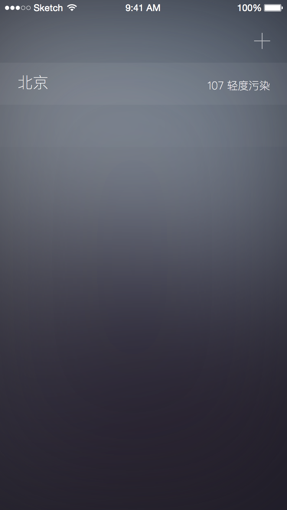
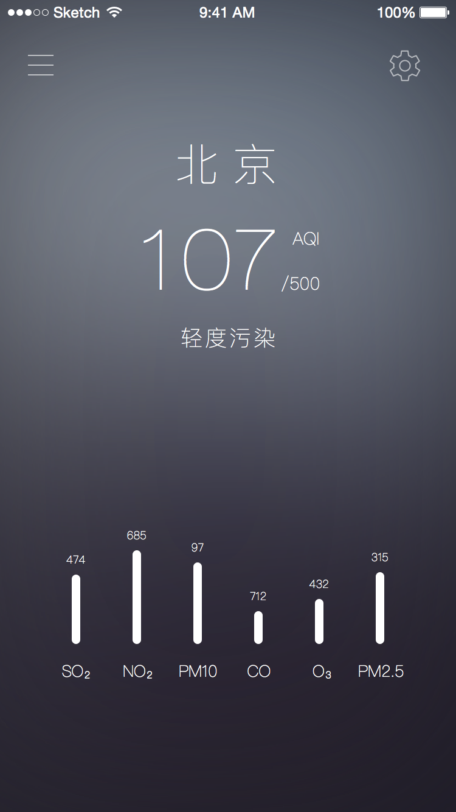

# 需求文档

## 城市设置

|功能需求 |  |
| - | - |
| 需求编号| NO.1|
| 需求名称| 城市设置 |
| 原型图 |   |
| 界面元素| <table><tr><th>序号</th><th>组件名称</th><th>描述</th></tr><tr><td>NO.1_1</td><td>添加按钮</td><td>点击进入城市选择界面 </td></tr><tr><td> NO.1_2 </td><td>城市列表</td><td>展示所有用户选中的城市（城市名、pm2.5、空气质量指数类别），点击在主界面展示该城市环境信息</td></tr></table> |

 

## 城市选择列表
|功能需求 |  |
| - | - |
| 需求编号| NO.2|
| 需求名称| 城市选择列表 |
| 原型图 | 暂无  |
| 界面元素| <table><tr><th>序号</th><th>组件名称</th><th>描述</th></tr><tr><td>NO.2_1</td><td>返回按钮</td><td>返回至城市设置界面 </td></tr><tr><td> NO.2_2 </td><td>所有城市列表</td><td>展示所有城市，点击某个城市，返回城市设置界面，并添加所选城市</td></tr></table> |

 

## 主界面

|功能需求 | |
| - | - |
| 需求编号| NO.3|
| 需求名称| 主界面 |
| 原型图 |   |
| 界面元素| <table><tr><th>序号</th><th>组件名称</th><th>描述</th></tr><tr><td>NO.3_1</td><td>城市设置导航按钮</td><td>城市设置和主界面切换开关 </td></tr><tr><td>NO.3_2</td><td>app设置导航按钮</td><td>app设置和主界面切换开关</td></tr><tr><td>NO.3_3</td><td>城市基本信息面板</td><td>城市名、AQI、空气质量指数类别</td></tr><tr><td>NO.3_4</td><td>城市环境信息详细图表</td><td>包含更为详细的环境信息表格</td></tr></table> |

 

## App设置界面

|功能需求 | |
| - | - |
| 需求编号| NO.4|
| 需求名称| App设置界面 |
| 原型图 | 暂无  |
| 界面元素| <table><tr><th>序号</th><th>组件名称</th><th>描述</th></tr><tr><td>NO.4_1</td><td>封面 </td><td>点击事件：更换封面/取消</td></tr><tr><td>NO.4_2</td><td>选项卡</td><td>“我”，“设置”，“关于”：分别对下方列表导航</td></tr><tr><td>NO.4_3</td><td>我</td><td>条目：<table><tr><td>姓名</td><tr/><tr><td>邮件</td><tr/><tr><td>电话</td><tr/><tr><td>地区</td><tr><td>登录/注销</td></table></td></tr>

 